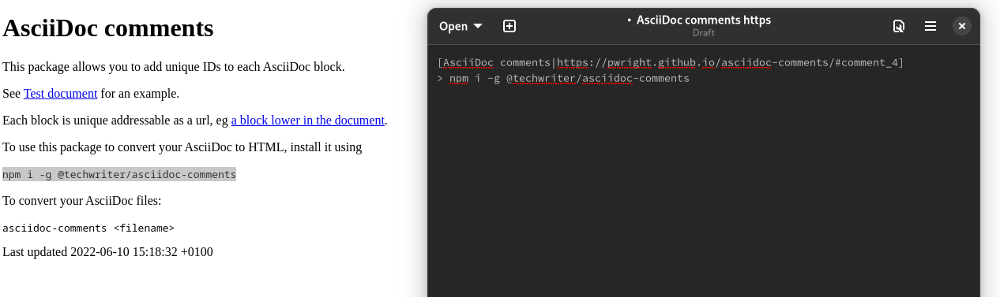

# Asciidoc comments

Render asciidoc to html making each block addressable.



To process your AsciiDoc files into html with an id for each block:

```bash
npm i -g @techwriter/asciidoc-comments
asciidoc-comments <filename>.adoc
```
See link:https://pwright.github.io/asciidoc-comments/[website] for more details
